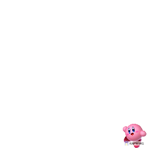
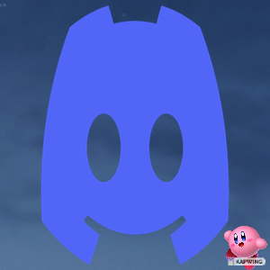

# Image Generator

`Image Generator` is a CLI tool based on `Cobra` library for helping creating image collages programmatically. You can refer to the following example:

With the following images:

background|logo|watermark|
----------|----------|----------|
||

After processing, you should be able to see the following output:



We welcome contributions though pull requests if you have any suggestions.

# CLI Overview

```
This tool provides an easy and extensible way to merge images.

Usage:
  generator [command]

Available Commands:
  help        Help about any command
  merge       Merge the images from the specified folders

Flags:
  -h, --help   help for generator

Use "generator [command] --help" for more information about a command.
```

# Getting started

* [Download](https://github.com/tsunejui/image-generator/releases) the tool for Windows, Mac and Linux. Please see [supported OS](./docs/support.md).

* To learn about the `Image Generator`, read the [documentation](./docs/README.md).
